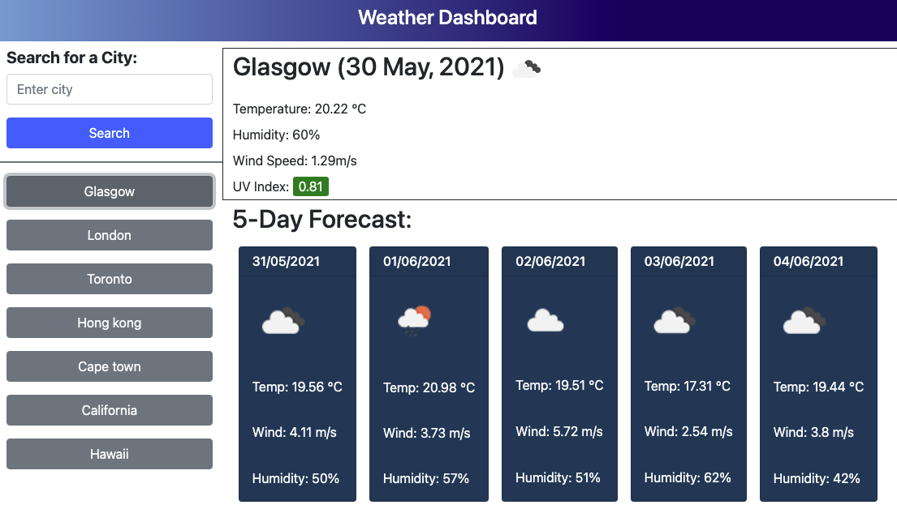

# Challenge 6 Server-Side APIs: Weather Dashboard

## Description
Using a weather API, retrieve weather data for cities that will run in users browser and feature dynamically updated HTML and CSS. LocalStorage used to store persistent data.

User can search for various cities, and once submit, will display current: city name, date, temperature, humidity, wind speed, and UV Index. It will also display a 5-day forecast to know when the best day to go to the beach is coming.

Done as a challenge for UoT's Coding Bootcamp.

## Talbe of Contents
* [Usage](#usage)
* [Links](#links)
* [Tools](#tools)
* [Credits](#credits)
* [Challenge Guidelines](#challenge-guidelines)

## Usage
Application that allows user search various cities to find current weather and a five day forecast.


## Links
### Deployed App:
* [Weather Dashboard](https://shannonnell.github.io/Weather-Dashboard/)

## Tools
* HTML 
* CSS
* JavaScript
* Bootstrap
* JQuery
* Moment

## Credits
* Completed by: [Nell-GitHub](https://github.com/ShannonNell)

## Challenge Guidelines
### User Story
```
AS A traveler
I WANT to see the weather outlook for multiple cities
SO THAT I can plan a trip accordingly
```

### Criteria: 
```
GIVEN a weather dashboard with form inputs
WHEN I search for a city
THEN I am presented with current and future conditions for that city and that city is added to the search history
WHEN I view current weather conditions for that city
THEN I am presented with the city name, the date, an icon representation of weather conditions, the temperature, the humidity, the wind speed, and the UV index
WHEN I view the UV index
THEN I am presented with a color that indicates whether the conditions are favorable, moderate, or severe
WHEN I view future weather conditions for that city
THEN I am presented with a 5-day forecast that displays the date, an icon representation of weather conditions, the temperature, the wind speed, and the humidity
WHEN I click on a city in the search history
THEN I am again presented with current and future conditions for that city
```
